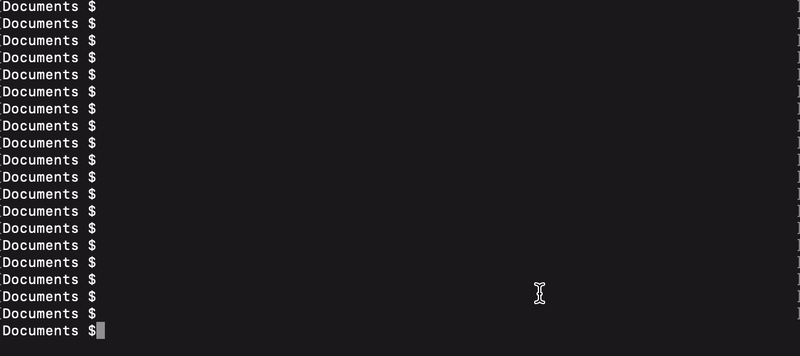

# Apstra Go - AOS Python Wrapper

The purpose of this is to wrap AOS API calls and logic within a 'simple to use' python wrapper. The initial use case for this is to quickly spin up demo testbeds using Juniper's public [vLabs](https://jlabs.juniper.net/vlabs/) tool.
## What can it do? 
  - Create, delete and list resource pools
  - Create new rack types
  - Create new DC templates
  - Create new blueprints
  - Add resources needed by the blueprint including ASN, IP, VNI pools
  - Create security zones and virtual networks
  - Create offbox agents to discover devcies
## How to use
Clone and use... just make sure you have Python3 installed, if not look [here](https://www.python.org/downloads/)

##### Clone
```sh
$ git clone https://github.com/iamjarvs/apstraGo.git 
$ cd apstraGo
```
##### Use
```sh
$ python3 apstraGo.py -- help
$ python3 apstraGo.py -u admin -p admin -a 192.168.1.50 -v 443 -c Acme_Corp
```
| Option | Description | Example |
| ------ | ------ | ------ |
| -u/- -username | AOS username | admin
| -p/- -password | AOS password | admin
| -a/- -address | AOS IP or DNS address | 192.168.1.1
| -v/- -port | AOS Port Number | 443
| -c/- -customer | The name of the customer | Acme_Corp
 


 ## Issues
 If you find issues please open an issue via GitHub.
 
 ## Contributing
 If you'd like to add, improve or correct anything pleas feel free to open a pull request.
