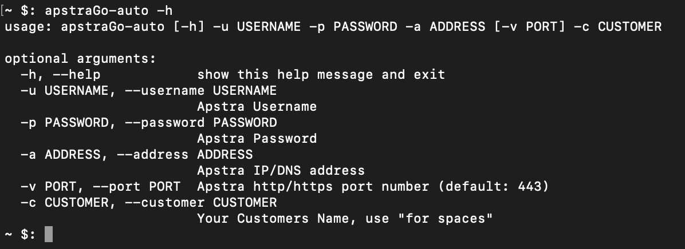
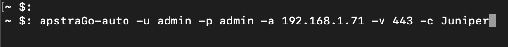

# ApstraGo - AOS Python Wrapper

The purpose of this is to wrap AOS API calls and logic within a 'simple to use' python wrapper. The initial use case for this is to quickly spin up demo testbeds using Juniper's public [vLabs](https://jlabs.juniper.net/vlabs/) tool.
## What can it do? 
  - Create, delete and list resource pools
  - Create new rack types
  - Create new DC templates
  - Create new blueprints
  - Add resources needed by the blueprint including ASN, IP, VNI pools
  - Create security zones and virtual networks
  - Create offbox agents to discover devices

There are three ways to use the ApstraGo package, firstly as a simple one-line command tool to create a demo environment, secondly using a YAML configuration file to configure Apstra and finally by interacting with the Apstra class directly. 

## Install
Make sure you have Python3 and Pip installed, if not look [here](https://www.python.org/downloads/)
```sh
python3 --version
pip --version
```

Then to install 
```sh
pip install apstraGo
```

## Uses

### ApstraGo-Auto

ApstraGo-Auto is built to be a one-line command tool that allows the user to easily create a working demo of the Juniper vLabs blueprint that can be freely accessed online. 

Once installed you simply need to enter a few details such as username, password, URL, port and customer name. Once this has been done the programme will automatically begin configuring the required resources needed to create a complete demo blueprint. 

Currently the only thing left once this is run is to assign the physical devices to the blueprint, create the port mapping of the configured leaf devices to the service and then commit the configuration so that it is pushed to the network. 

```sh
apstraGo-auto -u admin -p admin -a 192.168.1.50 -v 443 -c Acme_Corp
```
| Option | Description | Example |
| ------ | ------ | ------ |
| -u/- -username | AOS username | admin
| -p/- -password | AOS password | admin
| -a/- -address | AOS IP or DNS address | 192.168.1.1
| -v/- -port | AOS Port Number | 443
| -c/- -customer | The name of the customer | Acme_Corp
 






### 
### ApstraGo-YAML

ApstraGo-YAML has been designed to be a midground between a preconfigured and unconfigured test bed. It allows you to define the state you wish to achieve in a YAML file meaning you can customise the set up as you wish.

To use ApstraGo-YAML you just need to add the file path of the YAML file as an argument and this will be interpreted so to configure the Apstra server via the Python API wrapper.

```sh
apstraGo-yaml -f config.yaml
```

| Option | Description | Example |
| ------ | ------ | ------ |
| -f/- -filename | YAML Config File | config.yaml

To see the complete YAML options, please check the examples folder.


### Apstra Class API
The Apstra Class contains the raw methods used by the pre-mentioned tools, but these can be accessed and used to provide the most flexibility and allow integration with other projects.

To see how this works please check the examples folder.


 ## Issues
 If you find issues please open an issue via GitHub.
 
 ## Contributing
 If you'd like to add, improve or correct anything please feel free to open a pull request.
